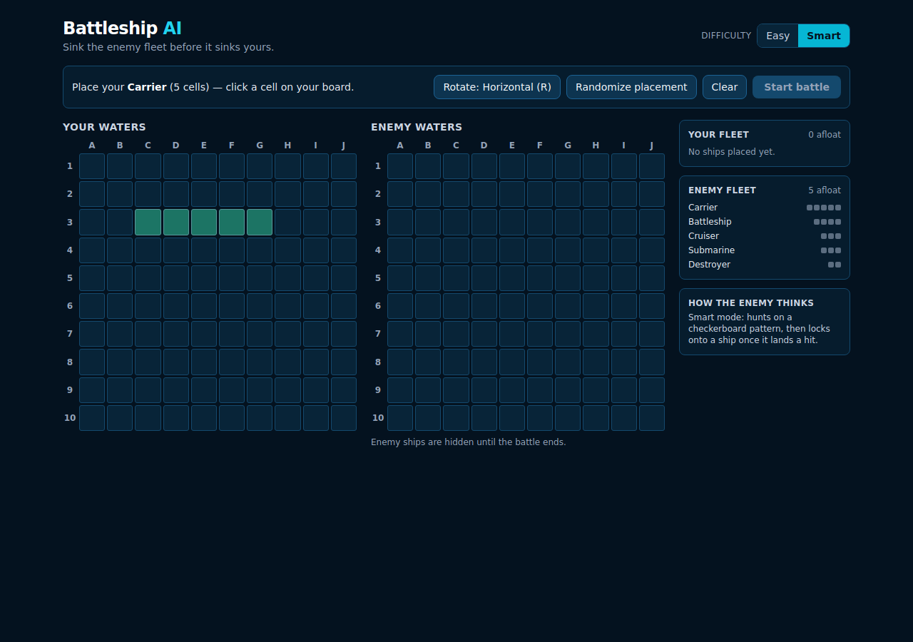
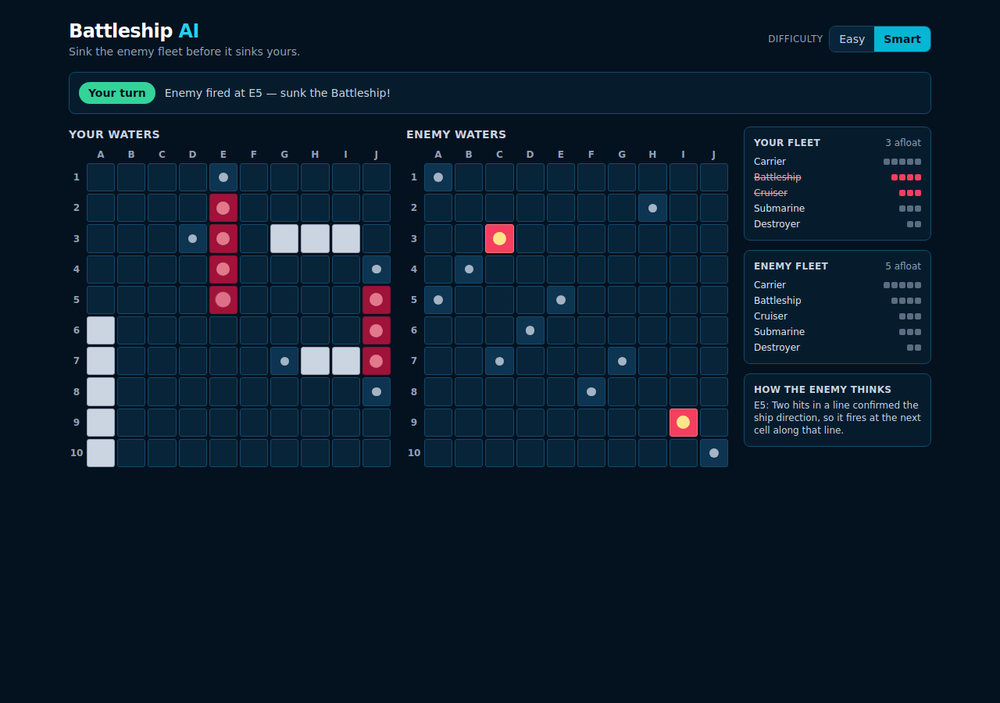

# Battleship AI

A browser Battleship game: place your fleet, then trade salvos with an AI opponent that
hunts with a checkerboard search pattern and locks onto ships once it draws blood.

**Play it:** https://aronh-ui.github.io/battleship-ai/




## Features

- Standard 10×10 grids with labelled axes (A–J across, 1–10 down) for both fleets.
- Standard fleet: Carrier (5), Battleship (4), Cruiser (3), Submarine (3), Destroyer (2).
- **Setup phase** — click-to-place with a live placement preview, a rotate toggle
  (button or the `R` key), `Randomize placement`, and `Clear`. Invalid placements are
  refused with an explanation (off-board vs. overlap).
- **Play phase** — alternating turns, a turn indicator, per-shot feedback, hit/miss/sunk
  markers, and "ships afloat" counts for both sides. Attacked cells cannot be attacked
  again.
- **AI opponent** — `Smart` (hunt-and-target, default) or `Easy` (random) difficulty,
  with a panel that explains in plain language why the AI fired where it did.
- **Game over** — a win/loss modal that reveals the AI's full fleet layout and offers
  `Play again`, which resets all state.
- Enemy ship positions are never revealed before the game ends, and per-ship damage on
  the enemy fleet panel stays hidden until a ship actually sinks.
- Responsive layout for desktop and mobile, with subtle hit/miss animations.

## Tech stack

| Concern    | Choice                                  |
| ---------- | --------------------------------------- |
| UI         | React 19 + TypeScript                   |
| Build      | Vite 8                                  |
| Styling    | Tailwind CSS 3                          |
| Unit tests | Vitest                                  |
| QA script  | Playwright (CDP, headed Chrome)         |
| Hosting    | GitHub Pages (Vercel / Netlify ready)   |

No backend, database or authentication: the whole game runs client-side, so the app is a
static bundle.

## Architecture

```
src/
  engine/          pure TypeScript game logic — no React, no DOM
    types.ts       board size, fleet definition, shared types
    board.ts       board creation, placement validation, attacks, sinking
    placement.ts   legal placement enumeration, random fleet layout
    ai.ts          hunt-and-target opponent
    game.ts        game state machine (setup -> playing -> gameover)
    coords.ts      A1-style coordinate labels
    random.ts      injectable RNG (seeded for deterministic tests)
    *.test.ts      Vitest suites for the engine
  components/      presentational React components
    GameBoard.tsx  10x10 grid renderer (own board, enemy board, reveal mode)
    FleetStatus.tsx  ships remaining / damage for one side
    GameOverModal.tsx
  App.tsx          the only stateful component: owns GameState and wires the UI
```

Design rules that keep the two halves apart:

- **The engine is pure.** Every engine function takes a state and returns a new state;
  nothing mutates its input and nothing touches the DOM, timers or `Math.random`
  directly (the RNG is a parameter, defaulting to `Math.random`). That is what makes the
  rules and the AI testable without rendering anything.
- **React owns only presentation and timing.** `App.tsx` holds a single `GameState`
  value and calls engine transitions (`placePlayerShip`, `startGame`, `playerAttack`,
  `aiAttack`, `resetGame`). The AI's shot is delayed by a timer purely so the player can
  read the result; the game logic itself is synchronous.
- **Illegal moves are rejected in the engine**, not just hidden in the UI: attacking out
  of turn, attacking twice, placing overlapping ships or firing after the game ends all
  return the state unchanged.

## How the AI works

The AI only ever looks at its own attack history — the cells it has fired at and what
each shot returned. It never reads your ship positions.

**Easy** — fires at a uniformly random cell it has not tried yet.

**Smart** — a two-mode hunt-and-target strategy:

1. **Hunt mode** (no damaged ship outstanding). It fires only at cells where
   `(row + column)` is even — a checkerboard. Since the smallest ship is two cells long,
   every ship must cover at least one checkerboard cell, so searching half the board is
   enough to find the whole fleet, at roughly half the cost of a blind search. Once the
   checkerboard is exhausted it falls back to any untried cell.
2. **Target mode** (it has hit a ship that has not sunk). With a single hit it probes the
   four orthogonal neighbours (N/S/E/W) of that hit. As soon as a second hit lines up
   with the first, it stops probing sideways and fires at the next cell along that line,
   continuing from either end until the ship sinks.
3. **Back to hunting.** When a ship sinks, the AI clears the hits belonging to that ship
   from memory. If it had damaged a second ship at the same time, those hits stay in
   memory and it keeps targeting them; otherwise it returns to the checkerboard hunt.

The in-game "How the enemy thinks" panel prints the reason for the AI's most recent shot,
so the strategy is visible while you play.

## Running locally

Requires Node.js 20.19+ or 22+ (Vite 8 / Rolldown requirement).

```bash
npm install
npm run dev        # http://localhost:5173
```

Other scripts:

```bash
npm run build      # type-check (tsc -b) and produce dist/
npm run preview    # serve the production build locally
npm run lint       # oxlint
npm test           # Vitest engine suite (single run)
npm run test:watch # Vitest in watch mode
```

## Tests

`npm test` runs the engine suites in `src/engine/*.test.ts` (51 tests):

- `board.test.ts` — board creation, horizontal/vertical placement, off-board and overlap
  rejection, immutability, hit/miss detection, duplicate-attack prevention, sinking,
  fleet-destroyed detection.
- `placement.test.ts` — legal placement enumeration, random fleet layouts across 50 seeds
  (no overlaps, no off-board cells, correct ship lengths), deterministic seeding,
  autofill preserving manually placed ships.
- `ai.test.ts` — checkerboard hunting, fallback when the parity half is exhausted, never
  repeating a cell over a whole game, single-hit probing, direction lock after two hits,
  returning to hunt mode after a sink, keeping a second damaged ship in memory, and Smart
  finishing a board in fewer shots than Easy.
- `game.test.ts` — setup ordering, rejection of invalid placements, start gating, turn
  alternation, out-of-turn and post-game attack rejection, win/loss detection, and
  `Play again` resetting state while keeping the chosen difficulty.
- `coords.test.ts` — A1-style coordinate labels.

There is also an end-to-end playthrough script used for QA
(`npm run qa:playthrough -- <url> [--easy] [--mobile]`). It drives a real browser over
CDP, plays a full game and fails on console errors; see `BUGS_AND_FIXES.md` for what it
covers and what it found.

## Deployment

The app is a static bundle (`dist/`), so any static host works. No environment variables
or secrets are required.

**GitHub Pages (what this repo uses)**

`.github/workflows/deploy.yml` runs the test suite, builds with
`BASE_PATH=/battleship-ai/` and publishes `dist/` on every push to `main`. Enable it once
under *Settings → Pages → Source: GitHub Actions*.

**Vercel**

```bash
npm i -g vercel
vercel --prod        # framework preset: Vite, build: npm run build, output: dist
```

**Netlify**

```bash
npm i -g netlify-cli
netlify deploy --prod --dir=dist   # after npm run build
```

Both providers also deploy straight from the GitHub repo with zero configuration: build
command `npm run build`, publish directory `dist`. Leave `BASE_PATH` unset there — the
bundle is then served from the domain root.

## Known limitations

- Single-player only: no multiplayer, no persistence, and refreshing the page starts a
  new game.
- Ships may touch each other; the variant that forbids adjacent ships is not implemented.
- Placement is click-to-place with a rotate toggle rather than drag-and-drop, and there
  is no "move a ship after placing it" (use `Clear` or `Randomize placement`).
- The Smart AI does not weight remaining ship lengths when hunting (a full probability
  density search would be stronger, at the cost of being much harder to explain).
- Switching difficulty mid-game takes effect immediately and keeps the AI's existing
  memory of damaged ships.
- The QA playthrough script needs a Chrome instance exposing a CDP endpoint; it is a
  developer tool, not part of `npm test`.
